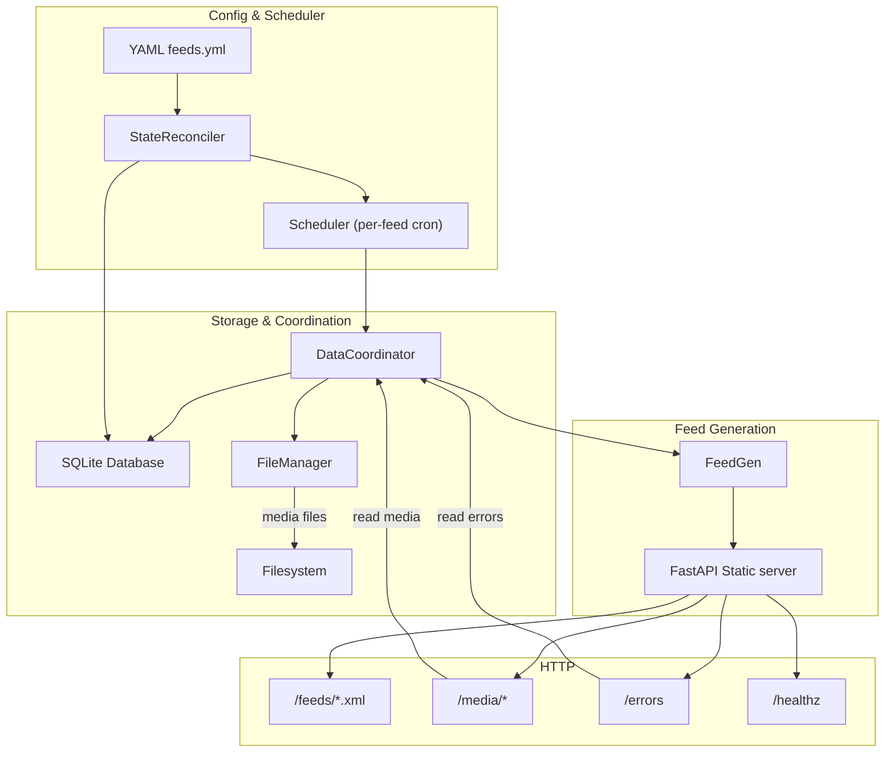
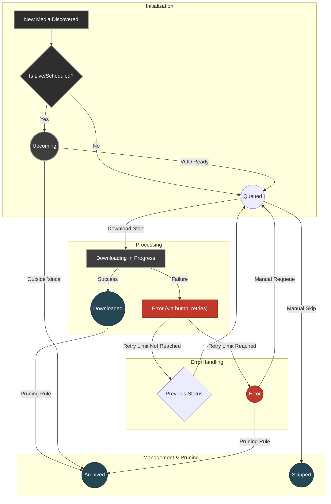
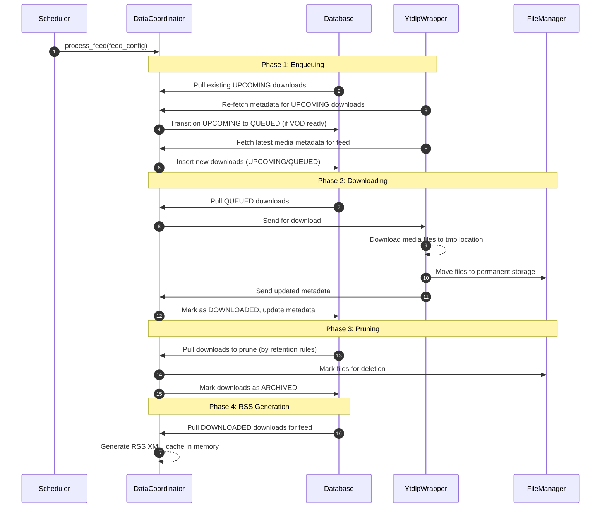

# Anypod – Design Document

**Last updated:** 2025-06-14

---

## Purpose
Anypod is a thin Python wrapper around **yt-dlp** that converts any yt-dlp–supported source—**video *or* audio**—into an RSS feed consumable by podcast players. It runs as a long-lived Docker container and is configured solely through YAML.

---

## Non-Goals
* Live-stream capture (only post-VOD downloads)
* Graphical UI (a JSON-driven admin dashboard can come later)
* Automatic retry loop beyond manual `--retry-failed`

---

## Design Principles

* **Error‑Handling Principle** – *Log‑and‑continue beats crash‑and‑burn.* - Any failure (network timeout, bad YAML, filesystem hiccup) should be isolated to that work item while the daemon keeps running. Only unrecoverable conditions—e.g., corrupted SQLite schema or a process‑wide permission error—warrant terminating the container.

* **Idempotent Operations** – Every scheduled job, download, prune, or feed‑generation step **must** be safe to repeat without side‑effects. This enables retry loops, crash recovery, and manual re‑runs.

* **Graceful Degradation** – When a subsystem reaches a hard limit (disk full, upstream API quota, etc.) the service enters a *degraded* mode: the offending feature pauses, the rest keeps working, and logs/metrics/`/healthz` make the problem obvious.

* **Atomic State Transitions** – Multi‑step changes (e.g., write file → update DB) complete in a single transaction or within an atomic unit so consumers never observe half‑baked state.

* **Observability First** – Emit structured logs (JSON) and Prometheus metrics for all critical paths. A feature isn't "done" until its behaviour can be seen on a dashboard.

* **Extensibility Path** – Public modules expose clean, focused interfaces; internals stay behind those seams. New storage back‑ends, GC algorithms, or auth methods should plug in without rewrites.

* **Dependency Injection & Testability** – External side effects (network, disk, time, randomness) are injected so unit tests can stub them and run fast.

* **Security by Default** – Runs as non‑root when possible, avoids storing secrets in plaintext, and uses the minimum network surface required to fetch media and serve HTTP.

* **Principle of Least Magic** – Configuration lives in YAML/env‑vars, not hidden defaults. Explicit beats implicit for paths, formats, and feature flags.

* **Minimal Footprint** – Prefer standard‑library or single‑purpose libraries; avoid pulling in heavyweight frameworks unless they deliver clear value.

---

## High-Level Architecture



### Layer Responsibilities

| Layer                               | Responsibility                                                                                                   | Key Points                                                                                           |
|-------------------------------------|------------------------------------------------------------------------------------------------------------------|------------------------------------------------------------------------------------------------------|
| **`AppSettings` (config/)**         | Parse & validate YAML into strongly‑typed models.                                                                | Environment‑variable overrides; default value injection; early failure on schema mismatch.           |
| **`StateReconciler`**               | Synchronize YAML configuration with database state on startup and config changes.                               | Handles feed creation/removal/updates; manages retention policy changes; preserves download history. |
| **`Scheduler`**                     | Trigger periodic `DataCoordinator.process_feed` jobs per‑feed cron schedule.                                     | Async scheduler; cron expressions validated at startup; stateless job store.                         |
| **Database Classes**                | Persistent metadata store (status, retries, paths, etc.). Specialized classes for downloads and feeds.          | `DownloadDatabase` + `FeedDatabase` + `SqlalchemyCore`; proper state transitions.                  |
| **`FileManager`**                   | All filesystem interaction: save/read/delete media, atomic RSS writes, directory hygiene, free‑space checks.     | Centralized path management; future back‑ends (S3/GCS) become plug‑ins.                             |
| **`YtdlpWrapper`**                  | Thin wrapper around `yt-dlp` for fetching media metadata and downloading media content.                          | Handler-based system; abstracts `yt-dlp` specifics; provides `fetch_metadata` and `download_media`. |
| **`FeedGen`** (rss/)**              | Generates RSS XML feed files based on current download metadata.                                                 | Manages in-memory feed cache with read/write locks; uses database classes & `FileManager`.          |
| **DataCoordinator Module**          | Houses services that orchestrate data lifecycle operations using foundational components and `FeedGen`.         | Uses database classes, `FileManager`, `YtdlpWrapper`, `FeedGen`. Main class is `DataCoordinator`.   |
|   ↳ **`DataCoordinator`**           | High-level orchestration of enqueue, download, prune, and feed generation phases.                                | Delegates to `Enqueuer`, `Downloader`, `Pruner`, and calls `FeedGen`. Ensures sequence.            |
|   ↳ **`Enqueuer`**                  | Fetches media metadata in two phases—(1) re-poll existing 'upcoming' entries to transition them to 'queued' when VOD; (2) fetch latest feed media and insert new 'queued' or 'upcoming' entries. | Uses `YtdlpWrapper` for metadata, database classes for DB writes.                                    |
|   ↳ **`Downloader`**                | Processes queued downloads: triggers downloads via `YtdlpWrapper`, saves files, and updates database records.        | Uses `YtdlpWrapper`, `FileManager`, database classes. Handles download success/failure.             |
|   ↳ **`Pruner`**                    | Implements retention policies by identifying and removing old/stale downloads and their files.                   | Uses database classes for selection, `FileManager` for deletion.                                     |
| **HTTP (FastAPI)**                  | Serve RSS feeds, media files, and API endpoints.                                                                 | Delegates look-ups to underlying components; zero business logic.                                                             |

---

## Configuration Example
```yaml
feeds:
  channel:
    url: https://www.youtube.com/@example
    yt_args: "-f worst[ext=mp4] --playlist-items 1-3"
    schedule: "0 3 * * *"
    since: "20220101"

  # Feed with full metadata overrides
  premium_podcast:
    url: https://www.youtube.com/@premium/videos
    schedule: "0 6 * * *"
    metadata:
      title: "My Premium Podcast"                                 # Override feed title
      subtitle: "Daily insights and discussions"                  # Feed subtitle
      description: "A daily podcast about technology and culture" # Feed description
      language: "en"                                              # Language code (e.g., 'en', 'es', 'fr')
      author: "John Doe"                                          # Podcast author
      author_email: "john@example.com"                            # Podcast author email
      image_url: "https://example.com/podcast-art.jpg"            # Original podcast artwork URL (min 1400x1400px, will be downloaded and hosted locally)
      podcast_type: "episodic"                                    # Podcast type: "episodic" or "serial"
      explicit: "no"                                              # Explicit content: "yes", "no", or "clean"
      category:                                                   # Apple Podcasts categories (max 2)
        - "Technology"                                            # Main category only
        - "Business > Entrepreneurship"                           # Main > Sub category
        # Alternative formats:
        # - {"main": "Technology"}
        # - {"main": "Business", "sub": "Entrepreneurship"}
        # Or as comma-separated string: "Technology, Business > Entrepreneurship"
```

### Environment Variables
Configure global application settings via environment variables:
```bash
DEBUG_MODE=enqueuer                    # Debug mode: ytdlp, enqueuer, downloader
LOG_FORMAT=json                        # Log format: human, json (default: human)
LOG_LEVEL=DEBUG                        # Log level: DEBUG, INFO, WARNING, ERROR (default: INFO)
LOG_INCLUDE_STACKTRACE=true           # Include stack traces in logs (default: false)
BASE_URL=https://podcasts.example.com  # Base URL for feeds/media (default: http://localhost:8024)
CONFIG_FILE=/path/to/feeds.yaml       # Config file path (default: /config/feeds.yaml)
DATA_DIR=/path/to/data                # Root directory for all application data (default: /data)
COOKIES_PATH=/path/to/cookies.txt     # Optional cookies.txt file for yt-dlp authentication (default: /cookies/cookies.txt)
TZ=America/New_York                    # Timezone for date parsing (default: system timezone)
SERVER_HOST=0.0.0.0                   # HTTP server host (default: 0.0.0.0)
SERVER_PORT=8024                      # HTTP server port (default: 8024)
ADMIN_SERVER_PORT=8025                 # Admin HTTP server port (default: 8025)
TRUSTED_PROXIES=["192.168.1.0/24"]    # Trusted proxy IPs/networks for reverse proxy support (default: None)
POT_PROVIDER_URL=http://bgutil-provider:4416  # Optional POT provider URL for YouTube PO tokens (default: None)
YT_CHANNEL=stable                      # yt-dlp update channel: stable, nightly, master, or version (default: stable)
YT_DLP_UPDATE_FREQ=12h                 # Minimum interval between yt-dlp --update-to invocations (default: 12h)
PUID=1000                             # User ID for non-root execution (Docker only)
PGID=1000                             # Group ID for non-root execution (Docker only)
```

*The `yt_args` field is parsed using shell-like syntax and converted to yt-dlp options dictionary, not passed verbatim.*

---

## Startup & Configuration Management

Anypod reconciles static YAML configuration with dynamic runtime state through a dedicated **StateReconciler** component that runs on startup and handles configuration changes.

### State Reconciliation Process

On startup, the system compares the YAML feed configuration against the database state:

* **New feeds** are inserted into the database with initial sync timestamps
* **Removed feeds** are marked as disabled rather than deleted (preserving download history)
* **Modified feeds** have their metadata and configuration updated in the database
* **Retention policy changes** trigger requeuing or archival of existing downloads as appropriate

This ensures the database always reflects the current configuration while preserving historical data.

### Initial Population

After reconciliation, the system performs an initial sync of all enabled feeds to ensure RSS feeds are available before the HTTP server starts. This guarantees that subscribers have immediate access to feed content upon service startup.

## Database Schema

### Downloads Table
```sql
CREATE TABLE downloads (
  feed                 TEXT NOT NULL,
  id                   TEXT NOT NULL,
  source_url           TEXT NOT NULL,
  title                TEXT NOT NULL,
  published            TEXT NOT NULL,           -- ISO 8601 datetime string
  ext                  TEXT NOT NULL,
  mime_type            TEXT NOT NULL,
  filesize             INTEGER NOT NULL,        -- bytes
  duration             INTEGER NOT NULL,        -- seconds
  status               TEXT NOT NULL,           -- upcoming | queued | downloaded | error | skipped | archived
  discovered_at        TEXT NOT NULL,           -- ISO 8601 datetime string
  updated_at           TEXT NOT NULL,           -- ISO 8601 datetime string
  remote_thumbnail_url TEXT,                    -- Original thumbnail URL from source
  thumbnail_ext        TEXT,                    -- Hosted thumbnail file extension (always "jpg")
  description          TEXT,                    -- description from source
  quality_info         TEXT,                    -- quality metadata
  retries              INTEGER NOT NULL DEFAULT 0,
  last_error           TEXT,
  downloaded_at        TEXT,                    -- ISO 8601 datetime string
  PRIMARY KEY (feed, id)
);
CREATE INDEX idx_feed_status ON downloads(feed, status);
CREATE INDEX idx_feed_published ON downloads(feed, published);
```

### Feeds Table
```sql
CREATE TABLE feeds (
  id                        TEXT NOT NULL PRIMARY KEY,
  is_enabled                INTEGER NOT NULL,        -- boolean as integer
  source_type               TEXT NOT NULL,           -- channel | playlist | single_video | unknown
  source_url                TEXT NOT NULL,
  resolved_url              TEXT,                    -- resolved URL for fetching, e.g., a channel's /videos tab URL

  -- Time keeping
  last_successful_sync      TEXT NOT NULL,                                                   -- ISO 8601 datetime string
  created_at                TEXT NOT NULL DEFAULT STRFTIME('%Y-%m-%dT%H:%M:%f+00:00','now'), -- ISO 8601 datetime string
  updated_at                TEXT NOT NULL DEFAULT STRFTIME('%Y-%m-%dT%H:%M:%f+00:00','now'), -- ISO 8601 datetime string
  last_rss_generation       TEXT,                                                            -- ISO 8601 datetime string

  -- Error tracking
  last_failed_sync          TEXT,                    -- ISO 8601 datetime string
  consecutive_failures      INTEGER NOT NULL DEFAULT 0,
  last_error                TEXT,

  -- Download tracking
  total_downloads           INTEGER NOT NULL DEFAULT 0, -- Computed: count of downloads with status DOWNLOADED

  -- Retention policies
  since                     TEXT,                    -- ISO 8601 datetime string
  keep_last                 INTEGER,

  -- Feed metadata overrides
  title                     TEXT,
  subtitle                  TEXT,
  description               TEXT,
  language                  TEXT,
  author                    TEXT,
  author_email              TEXT,
  remote_image_url        TEXT,                              -- Original image URL from source (will be downloaded)
  category                  TEXT NOT NULL DEFAULT 'TV & Film', -- Stored as string, parsed into PodcastCategories
  podcast_type              TEXT NOT NULL DEFAULT 'episodic',  -- Stored as string, parsed into PodcastType
  explicit                  TEXT NOT NULL DEFAULT 'NO'         -- Stored as string, parsed into PodcastExplicit
);
```

### AppState Table
```sql
CREATE TABLE appstate (
  id                        TEXT NOT NULL PRIMARY KEY,  -- Always "global"
  last_yt_dlp_update        TEXT NOT NULL               -- ISO 8601 datetime string
);
```

**Key Schema Notes:**
* `ext` and `mime_type` are both **NOT NULL**; absence indicates a metadata-extraction bug.
* All datetime fields are stored as ISO 8601 strings in TEXT columns.
* `downloaded_at` is automatically set by database trigger when status changes to DOWNLOADED.
* `updated_at` is automatically updated by database trigger on any row change.
* The `feeds` table stores both configuration and runtime state for each feed.
* The `appstate` table contains a single row with ID "global" used to track application-wide state such as yt-dlp update timestamps for rate limiting.

### Status Lifecycle
The `status` field in the `downloads` table tracks the state of each download.



**State Definitions and Transitions:**

**1. UPCOMING**
* **When set:** A newly discovered item is known to be a future live stream or scheduled premiere.
* **Transitions to:**
  * **QUEUED** — as soon as its VOD becomes available.
  * **ARCHIVED** — if it falls outside the “since” or "keep_last" window without ever queuing.

**2. QUEUED**
* **When set:**
  * A new VOD is first discovered.
  * An UPCOMING item transitions to VOD-ready.
  * An ERROR item is manually re-queued.
* **Transitions to:**
  * **DOWNLOADED** — on successful download.
  * **ERROR** — if a download attempt exceeds max retries.
  * **(remains QUEUED)** — if a retryable failure occurs (retries bump, but not max).

**3. DOWNLOADED**
* **When set:** A media file has been fetched and stored successfully.
* **Transitions to:**
  * **ARCHIVED** — later pruned per retention rules.

**4. ERROR**
* **When set:** A fetch or download failure has hit the retry limit.
* **Transitions to:**
  * **QUEUED** — if manually re-queued for another attempt.
  * **ARCHIVED** — when the pruner applies retention.

**5. SKIPPED**
* **When set:** A user explicitly marks a download as “skip.” Any other state can be transitioned to this one.
* **Transitions to:**
  * **QUEUED** - if it is unskipped, automatically transitions back to the queue to be downloaded again
  * **ARCHIVED** - if it is unskipped but falls out of `since` or `keep_last`, transition to ARCHIVED; we may need a way in the future to be able to "bookmark" downloads so that they never get archived; but for now, leaving that out of scope

**6. ARCHIVED**
* **When set:** Pruner moves UPCOMING, DOWNLOADED, or ERROR items out of active retention (`keep_last` or `since`).
* **Terminal:** No automatic re-activation.

---

## Processing Flow


The `Scheduler` triggers the `DataCoordinator` to process a feed, which is done with four distinct phases using specialized services:

1.  **Enqueuing Phase**: The `Enqueuer` performs a two-stage process:
    - Re-polls existing UPCOMING downloads to check if they're now available as VOD
    - Fetches latest metadata from the feed source and inserts new downloads
    - Updates feed metadata in the database

2.  **Download Phase**: The `Downloader` processes queued downloads:
    - Downloads media files to temporary locations via `YtdlpWrapper`
    - Moves completed files to permanent storage via `FileManager`
    - Updates database with DOWNLOADED status and final metadata

3.  **Pruning Phase**: The `Pruner` applies retention policies:
    - Identifies downloads that exceed `keep_last` or fall outside `since` date
    - Removes media files from storage and marks downloads as ARCHIVED

4.  **RSS Generation Phase**: The `RSSFeedGenerator` creates podcast feeds:
    - Fetches DOWNLOADED items from database
    - Generates RSS XML and caches it in memory with thread-safe locking
    - RSS is served from memory cache, not filesystem

Each phase includes comprehensive error handling and retry logic. Failed operations increment retry counters and transition downloads to ERROR status when limits are exceeded.

---

## YouTube URL Handling by `YtdlpWrapper`

The `YtdlpWrapper` is designed to provide a consistent interface for fetching metadata regardless of the exact type of YouTube URL provided in the feed configuration. It intelligently handles:

1.  **Channel URLs** (e.g., `https://www.youtube.com/@ChannelName`):
    *   Anypod first performs a lightweight "discovery" request to identify the URL as a channel page.
    *   It then attempts to locate the channel's primary "Videos" tab (e.g., `https://www.youtube.com/@ChannelName/videos`).
    *   This resolved "Videos" tab URL is then used for the main metadata fetch. All user-provided `yt_args` are applied to this resolved URL.
    *   *Future enhancement*: Allow configuration to target other tabs like "Live" or "Shorts".

2.  **Playlist URLs** (e.g., `https://www.youtube.com/playlist?list=PL...`, or a specific channel tab URL like `https://www.youtube.com/@ChannelName/videos`):
    *   These are treated as direct playlists. Metadata is fetched for the downloads within this playlist, respecting user-provided `yt_args`.

3.  **Single Video URLs** (e.g., `https://www.youtube.com/watch?v=VideoID`):
    *   Metadata for the single video is fetched.

This resolution logic aims to simplify configuration for the end-user, as they can often provide a general channel URL and Anypod will attempt to find the most relevant video list. The `feed_id` provided in the configuration is used as the primary `source_identifier` for associating downloads with their feed, ensuring consistency.

---

## Feed Persistence

The `RSSFeedGenerator` module maintains a **write-once/read-many-locked in-memory cache**:
- RSS XML is stored as bytes in memory keyed by `feed_id` with thread-safe read/write locking
- When the DataCoordinator generates a feed, it replaces the cached bytes under a write lock
- HTTP handlers retrieve cached feeds after acquiring a read lock
- Cache population on startup will occur when the scheduler and HTTP server are implemented

## HTTP Endpoints

### Public Endpoints
| Path | Description |
|------|-------------|
| `/feeds` | HTML directory listing of available feeds |
| `/feeds/{feed}.xml` | Podcast RSS |
| `/media` | HTML directory listing of feed directories |
| `/media/{feed}` | HTML directory listing of media files for feed |
| `/media/{feed}/{file}` | MP4 / M4A enclosure |
| `/images/{feed}.jpg` | Feed artwork/thumbnail |
| `/images/{feed}/{download_id}.jpg` | Episode thumbnail |
| `/errors` | JSON list of failed downloads |
| `/api/health` | Health check endpoint returning service status, timestamp, and version |

### Admin Endpoints (Private/Trusted Access)
| Path | Description |
|------|-------------|
| `POST /admin/feeds/{feed_id}/reset-errors` | Reset all ERROR downloads for a feed to QUEUED status |

---

## Logging Guidelines

*   **Structured Logging:** Add relevant context to the `extra` dictionary instead of embedding it in log messages. Both JSON and human-readable formats are supported.
*   **Context Propagation:**
    *   Include `feed_id` and relevant download identifiers in the `extra` dictionary for feed/media processing logs.
    *   Context IDs enable correlation of related log messages across the complete processing flow for each feed operation.
*   **Log Level Semantics:**
    *   `DEBUG`: Developer tracing and verbose operational details.
    *   `INFO`: Normal system operations, milestones, and successful completions.
    *   `WARNING`: Recoverable issues that don't stop operations but may need attention (e.g., retryable download failures).
    *   `ERROR`: Specific operation failures requiring attention while system continues with other tasks.
    *   `CRITICAL`: Severe runtime errors threatening application stability.
*   **Enhanced Exception Handling:** Custom exceptions carry diagnostic data. The logging system automatically extracts custom attributes from exception chains and builds semantic traces for comprehensive error context.
*   **Security:** Never log secrets (API keys, passwords) or PII. The logging system handles unserializable values gracefully.
*   **Configuration:** Log format (JSON/human), level, and stack trace inclusion are configurable via CLI flags or environment variables.

---

## Command-Line Flags

### Usage
```bash
uv run anypod [options]
```

### Core Flags
* `--config-file PATH` – custom YAML path (default `/config/feeds.yaml`)
* `--debug-mode {ytdlp,enqueuer,downloader}` – run specific debug mode instead of full service
* `--base-url URL` – base URL for feeds/media (default: http://localhost:8024)
* `--tz TIMEZONE` – timezone for date parsing (default: system timezone)
* `--ignore-startup-errors` – TODO
* `--retry-failed` – TODO

### Logging Flags
* `--log-level {DEBUG,INFO,WARNING,ERROR}` – logging level (default: INFO)
* `--log-format {human,json}` – log output format (default: json)
* `--log-include-stacktrace` – include stack traces in error logs (default: false)

### Environment Variables
All CLI flags can alternatively be set via environment variables using uppercase names with underscores (e.g., `DEBUG_MODE=enqueuer`, `LOG_LEVEL=DEBUG`).

---

## Deployment
| Aspect | Setting |
|--------|---------|
| **Image** | `ghcr.io/thurstonsand/anypod:nightly` |
| **Base** | `debian:bookworm-slim` with uv-managed Python 3.13 |
| **User** | Runs as **root (UID 0)** by default; automatically switches to non-root user (PUID/PGID) if specified |
| **Volumes** | `/config`, `/data`, `/cookies` |
| **Port** | 8024 |
| **Health Check** | `curl -f http://localhost:8024/api/health` |
| **CI/CD** | GitHub Actions auto-publishes to GHCR on main branch pushes and version tags |

---

## Dependencies & Tooling
* **Package Management:** **uv** with `pyproject.toml` + `uv.lock` for reproducible builds
* **Core Dependencies:** pydantic, SQLModel, SQLAlchemy, feedgen, yt-dlp (pinned to minimum version), APScheduler
* **Development Tools:** ruff (linting/formatting), pyright (type checking), pytest ecosystem (testing), pre-commit (git hooks)

---

## yt-dlp Date Precision Limitation

yt-dlp only allows for day-level date precision when filtering by date (`YYYYMMDD`):

yt-dlp's `daterange` parameter only supports YYYYMMDD format, not hour/minute/second precision. This means:
- `fetch_since_date = 2025-06-17T08:00:00Z` becomes `start_date = "20250617"`
- `fetch_until_date = 2025-06-17T10:00:00Z` becomes `end_date = "20250617"`
- Both become identical date ranges when passed to yt-dlp
- Anypod may often query the same days (depending on how user sets up their cron), so it dedups anything it's seen before.

---

## Implementation Status & Future Work

### Database Optimizations
* **Additional Indexes** - Analyze query patterns and add indexes as needed for performance
* **Query Performance** - Review complex queries in `DownloadDatabase` and `FeedDatabase`

### Future Enhancements
* Admin dashboard (React + shadcn/ui)
* Automatic retries with jitter
* Advanced video conversion options beyond yt-dlp's built-in transcoding
* OAuth device-flow
* Prometheus `/metrics`
* Consider restricting feed_id and download_id in `PathManager` to alphanumeric characters only (plus maybe hyphens/underscores) to avoid potential filesystem and URL encoding issues
* Support transcripts/auto-generated (whisper can natively output .srt files)
  * > I'm a podcast author, how can I add transcripts to my show?
    > In order for Pocket Casts to discover transcripts for an episode and offer them within the app, the podcast feed must include the <podcast:transcript> element and the transcript must be in one of the following formats: VTT, SRT, PodcastIndex JSON, or HTML.
* include global size limit such that entire app doesnt exeed certain size
  * need to explore options around how to evict downloads if exceeded; some ideas below
  *
    | Policy                                   | What it does                                                                                                                                | Strengths                                                    | Watch‑outs                                                                                                 |
    |------------------------------------------|---------------------------------------------------------------------------------------------------------------------------------------------|--------------------------------------------------------------|------------------------------------------------------------------------------------------------------------|
    | **Min‑floor + global LRU** *(recommended)* | Add `min_last:` per feed (default = 1). Delete oldest downloads across *all* feeds until the cap is met **but never go below `min_last` for any feed**. | Simple mental model; prevents "rare" shows from disappearing. | If every feed is at its floor and cap is still breached, system enters "degraded‑full" state and refuses new downloads. |
    | **Time‑window floor**                    | Keep at least *N* days of history per feed (`min_days:`). Evict globally‑oldest downloads that fall outside each feed's window.                  | Users often reason in "last 90 days" rather than episode counts. | Variable episode sizes make space usage less predictable.                                                  |
    | **Weighted eviction**                    | Allow optional `weight:` per feed; compute *effective LRU‑age* = `real_age / weight`. Evict by that metric.                                 | Lets you bias important feeds without hard floors.            | Harder to predict which download will vanish next; extra YAML tuning.                                          |
    | **Quota borrow/return**                  | Each feed gets `quota = max_total/N`. Feeds may borrow unused space from others up to `borrow_limit%`. GC first reclaims borrowed space, then local quota, then uses global LRU. | Self‑balancing; high‑volume feeds thrive while small ones keep minimum. | Most complex to implement; needs periodic re‑balancing pass.                                               |
    | **Archive tier**                         | Move oldest media to a cheap "cold" volume (e.g., S3/Glacier) instead of deleting, while pruning DB rows locally.                           | No data loss; total cap becomes *hot‑tier* only.             | Requires new storage backend; retrieval latency for old episodes.                                          |
* integrate with sponsorblock -- either skip blocked sections, or add chapters to download; yt-dlp has options for it already!
  * in coordination with this, support delaying downloads so that there is time for sponsorblock to be added
* add per-source rate limiting
* issue template include rules on requesting support for new source
* enable a podcast feed that accepts requests to an endpoint to add individual videos to the feed; basically manually curated
  * also include manual audio file uploads
* performance testing once both server and cron exist -- does the cron being active cause slow down for the server?
* allow for download-time quality settings AND feed-time quality settings; you can download in high quality, deliver in low quality (for archival purposes
* consider async'ifying the code base. e.g. https://github.com/omnilib/aiosqlite)
  - consider SQLAlchemy as well
* potentially add support for [websub](https://websubhub.com/)

* Optimization: Consider merging the enqueuer and downloader into a single component. This would allow immediate downloads for videos that are ready, bypassing the QUEUED state. However, this raises the question of how to handle upcoming videos... maybe a dedicated live handler? but might lead to duplicate download logic.
* Optimize RSS generation by only regenerating feeds when new content is detected since last sync, using feed-level tracking of last sync timestamp and content changes.
* User-configurable quality settings with API to change quality preferences after initial setup, including separate download-time vs feed-time quality options.
* Chapter support for podcasts: extract chapter information from source videos and include in RSS feeds using podcast namespace standards.
* Think about ways to incorporate LLMs into the interface
* Support Patreon
* Add automatic podcast category mapping using yt-dlp metadata: map YouTube categories to Apple Podcasts categories, enhance with tag and description analysis, and support channel-specific overrides. Implement priority-based logic in `ytdlp_wrapper/category_mapper.py` to select the best category based on YouTube category, tags, description keywords, and known channel mappings, with a fallback if no match is found.
* Support "generic source" after looking at overlap from a few sources
* crop thumbnails so they are the right ratio
* configurable channel tab selection: allow users to specify which tab (videos, shorts, live, etc.) to use when discovering channel URLs, with /videos as default
* just store rss feeds in the db, don't keep them in-memory (fixes race condition on boot)
* Enable conditional conversion of file format to allow for more flexible selectors
* handle the scenario where adding a new feed with a restrictive filter that doesn't pick up any videos (`since` too recent); in this case, it will error out because it won't have metadata to generate the rss feed. in this case, it should error, but continue generating as normal
* combine enqueuer and downloader into 1 call -- should be possible by using something like `--no-simulate`
* store media conversion report