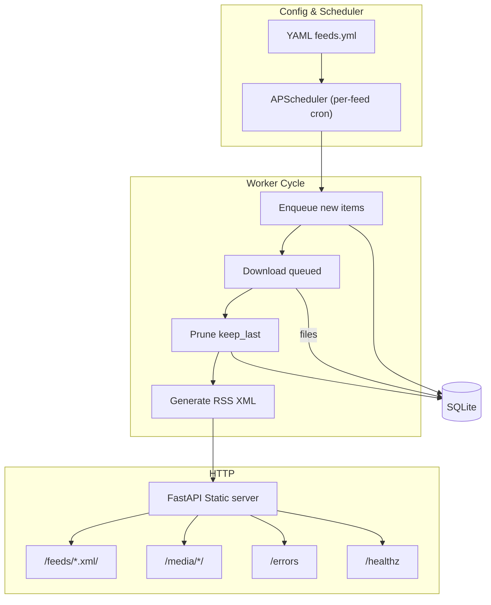
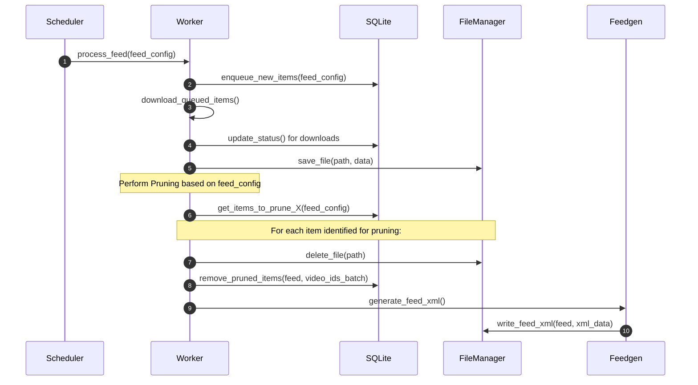

# Anypod – Design Document

**Last updated:** 2025-04-28

---

## 1  Purpose
Anypod is a thin Python wrapper around **yt-dlp** that converts any yt-dlp–supported source—**video *or* audio**—into an RSS feed consumable by podcast players. It runs as a long-lived Docker container and is configured solely through YAML.

---

## 2  Non-Goals
* Live-stream capture (only post-VOD downloads)
* Transcoding in the MVP (requires MP4/M4A from source)
* Graphical UI (a JSON-driven admin dashboard can come later)
* Automatic retry loop beyond manual `--retry-failed`

---

## 3  High-Level Architecture


---

## 4  Configuration Example
```yaml
feeds:
  this_american_life:
    url: https://www.youtube.com/@thisamericanlife/playlists
    yt_args: |
      -f "(bestvideo[ext=mp4][height<=1080]+bestaudio[ext=m4a]/best[ext=mp4])"
      --cookies /cookies/tal.txt
    schedule: "0 3 * * *"          # cron (required)
    keep_last: 100                 # prune policy (optional)
    since: "2024-01-01T00:00:00Z"  # ignore older videos (optional)
  radio_lab:
    ...
```
*Only the keys above are validated; any other text inside `yt_args` is passed verbatim to yt-dlp.*

---

## 5  Database Schema
```sql
CREATE TABLE downloads (
  feed         TEXT NOT NULL,
  video_id     TEXT NOT NULL,
  source_url   TEXT NOT NULL,
  title        TEXT,
  published    TEXT,
  ext          TEXT NOT NULL,
  duration     REAL,
  thumbnail    TEXT,
  path         TEXT,
  status       TEXT NOT NULL,          -- queued | downloaded | error | skipped
  retries      INTEGER NOT NULL DEFAULT 0,
  last_error   TEXT,
  PRIMARY KEY  (feed, video_id)
);
CREATE INDEX idx_feed_status ON downloads(feed, status);
```
* `ext` is **NOT NULL**; absence indicates a metadata-extraction bug.
* `mime` is derived from `ext` at feed-generation time via lookup table.

### Status lifecycle
1. **queued** – metadata accepted; waiting to download
2. **downloaded** – file saved; path filled
3. **error** – last attempt failed; requires `--retry-failed`
4. **skipped** – outside current `since` window; excluded from RSS

---

## 6  Processing Flow


* Pruning of old items is handled by a multi-step process:
  1. Identify items to prune.
  2. Delete associated media files (via FileManager).
  3. Remove item records from DB.

---

## 7  HTTP Endpoints
| Path | Description |
|------|-------------|
| `/feeds/{feed}.xml` | Podcast RSS |
| `/media/{feed}/{file}` | MP4 / M4A enclosure |
| `/errors` | JSON list of failed downloads |
| `/healthz` | 200 OK |

---

## 8  Command-Line Flags (MVP)
* `--config PATH` – custom YAML path (default `/config/feeds.yml`)
* `--ignore-startup-errors` – keep running if validation fails (feed disabled in memory)
* `--retry-failed` – reset `error` → `queued` rows before scheduler starts
* `--log-level LEVEL`

---

## 9  Deployment
| Aspect | Setting |
|--------|---------|
| **Image** | `ghcr.io/thurstonsand/anypod:latest` |
| **Base** | `python:3.13-slim` |
| **User** | Runs as **root (UID 0)** by default; override via `ANYPOD_UID`/`ANYPOD_GID` env-vars, handled in ENTRYPOINT. |
| **Volumes** | `/config`, `/data`, `/cookies` |
| **Port** | 8000 |

---

## 10  Dependencies & Tooling
* Managed by **uv** (`pyproject.toml` + `uv.lock`).
* yt-dlp pinned to specific commit.
* Dev deps: black · ruff · isort · pytest-asyncio · httpx · sqlite-utils · pre-commit.

---

## 11  Future Work
* Admin dashboard (React + shadcn/ui)
* Automatic retries with jitter
* Transcoding fallback (ffmpeg) for non-MP4/M4A sources
* OAuth device-flow
* Prometheus `/metrics`
* Support transcripts/auto-generated (whisper can natively output .srt files)
  * > I'm a podcast author, how can I add transcripts to my show?
    > In order for Pocket Casts to discover transcripts for an episode and offer them within the app, the podcast feed must include the <podcast:transcript> element and the transcript must be in one of the following formats: VTT, SRT, PodcastIndex JSON, or HTML.