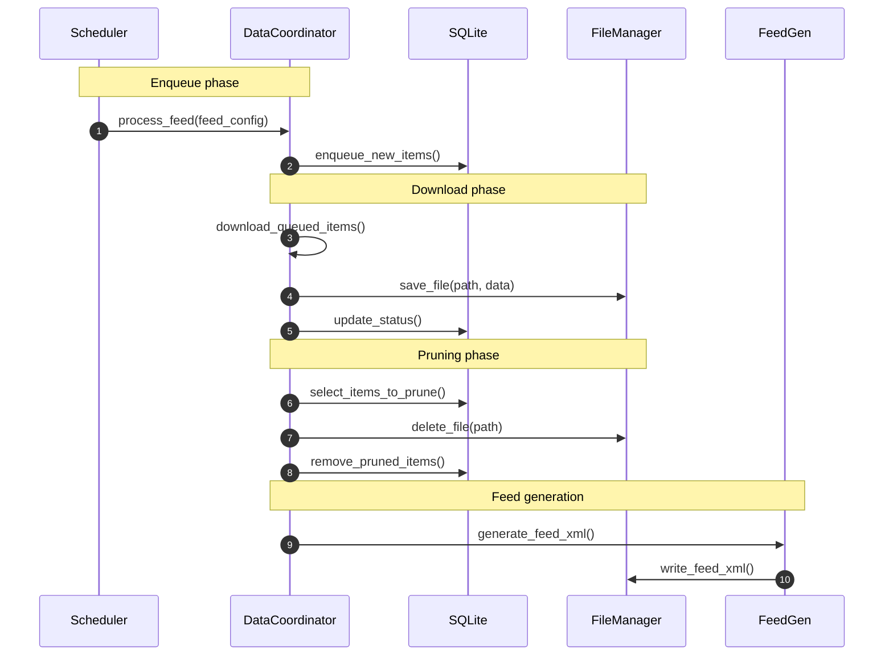

# Anypod – Design Document

**Last updated:** 2025-05-07

---

## 1  Purpose
Anypod is a thin Python wrapper around **yt-dlp** that converts any yt-dlp–supported source—**video *or* audio**—into an RSS feed consumable by podcast players. It runs as a long-lived Docker container and is configured solely through YAML.

---

## 2  Non-Goals
* Live-stream capture (only post-VOD downloads)
* Transcoding in the MVP (requires MP4/M4A from source)
* Graphical UI (a JSON-driven admin dashboard can come later)
* Automatic retry loop beyond manual `--retry-failed`

---

## 3  High-Level Architecture


### 3.1 Layer Responsibilities

| Layer                       | Responsibility                                                                                               | Key Points                                                                                 |
| --------------------------- | ------------------------------------------------------------------------------------------------------------ | ------------------------------------------------------------------------------------------ |
| **ConfigLoader**            | Parse & validate YAML into strongly‑typed models.                                                            | Environment‑variable overrides; default value injection; early failure on schema mismatch. |
| **Scheduler (APScheduler)** | Trigger periodic `process_feed` jobs per‑feed cron schedule.                                                 | Async scheduler; cron expressions validated at startup; stateless job store.               |
| **DatabaseManager**         | Persistent metadata store (status, retries, paths, etc.).                                                    | Single connection pool; WAL mode for concurrency; no direct file I/O.                      |
| **FileManager**             | All filesystem interaction: save/read/delete media, atomic RSS writes, directory hygiene, free‑space checks. | Path resolution lives here; future back‑ends (S3/GCS) become plug‑ins.                     |
| **DataCoordinator**         | High‑level orchestration over DB + FS. Exposes cohesive "data plane" API used by workers & HTTP layer.       | Manages multi‑step pruning, discrepancy detection (DB⇄FS drift), recovery flows.           |
| **HTTP (FastAPI)**          | Serve static RSS & media and expose health/error JSON.                                                       | Delegates look‑ups to DataCoordinator; zero business logic.                                |

---

## 4  Configuration Example
```yaml
feeds:
  this_american_life:
    url: https://www.youtube.com/@thisamericanlife/playlists
    yt_args: |
      -f "(bestvideo[ext=mp4][height<=1080]+bestaudio[ext=m4a]/best[ext=mp4])"
      --cookies /cookies/tal.txt
    schedule: "0 3 * * *"          # cron (required)
    keep_last: 100                 # prune policy (optional)
    since: "2024-01-01T00:00:00Z"  # ignore older videos (optional)
  radio_lab:
    ...
```
*Only the keys above are validated; any other text inside `yt_args` is passed verbatim to yt-dlp.*

---

## 5  Database Schema
```sql
CREATE TABLE IF NOT EXISTS downloads (
  feed         TEXT NOT NULL,
  video_id     TEXT NOT NULL,
  source_url   TEXT NOT NULL,
  title        TEXT NOT NULL,
  published    TEXT NOT NULL,            -- ISO 8601 datetime string
  ext          TEXT NOT NULL,
  duration     REAL NOT NULL,            -- seconds
  thumbnail    TEXT,                     -- URL
  path         TEXT,                     -- Absolute path to downloaded file
  status       TEXT NOT NULL,            -- queued | downloaded | error | skipped
  retries      INTEGER NOT NULL DEFAULT 0,
  last_error   TEXT,
  PRIMARY KEY  (feed, video_id)
);
CREATE INDEX idx_feed_status ON downloads(feed, status);
```
* `ext` is **NOT NULL**; absence indicates a metadata-extraction bug.
* `mime` is derived from `ext` at feed-generation time via lookup table.

### Status lifecycle
1. **queued** – metadata accepted; waiting to download
2. **downloaded** – file saved; path filled
3. **error** – last attempt failed; requires `--retry-failed`
4. **skipped** – outside current `since` window; excluded from RSS

---

## 6  Processing Flow


*All business logic is routed through DataCoordinator; other modules should treat DB & FS as internal details.*

---

## 7  Feed Persistence

- The `FeedGen` module maintains a **write-once/read-many-locked in-memory cache**:
  - When the scheduler generates a feed, it replaces the cached bytes under a write lock.
  - HTTP handlers retrieve the feed after receiving a read lock.
  - On startup the cache is populated since all feeds will be retrieved immediately.

## 8  HTTP Endpoints
| Path | Description |
|------|-------------|
| `/feeds/{feed}.xml` | Podcast RSS |
| `/media/{feed}/{file}` | MP4 / M4A enclosure |
| `/errors` | JSON list of failed downloads |
| `/healthz` | 200 OK |

---

## 9  Command-Line Flags (MVP)
* `--config-file PATH` – custom YAML path (default `/config/feeds.yml`)
* `--ignore-startup-errors` – keep running if validation fails (feed disabled in memory)
* `--retry-failed` – reset `error` → `queued` rows before scheduler starts
* `--log-level LEVEL`

---

## 10  Deployment
| Aspect | Setting |
|--------|---------|
| **Image** | `ghcr.io/thurstonsand/anypod:latest` |
| **Base** | `python:3.13-slim` |
| **User** | Runs as **root (UID 0)** by default; override via `user: "#{UID}:{GID}"` in docker-compose |
| **Volumes** | `/config`, `/data`, `/cookies` |
| **Port** | 8000 |

---

## 11  Dependencies & Tooling
* Managed by **uv** (`pyproject.toml` + `uv.lock`).
* yt-dlp pinned to specific commit.
* Dev deps: ruff · pytest-asyncio · pytest-cov · pyright · pre-commit

---

## 12  Future Work
* Admin dashboard (React + shadcn/ui)
* Automatic retries with jitter
* Transcoding fallback (ffmpeg) for non-MP4/M4A sources
* OAuth device-flow
* Prometheus `/metrics`
* Support transcripts/auto-generated (whisper can natively output .srt files)
  * > I'm a podcast author, how can I add transcripts to my show?
    > In order for Pocket Casts to discover transcripts for an episode and offer them within the app, the podcast feed must include the <podcast:transcript> element and the transcript must be in one of the following formats: VTT, SRT, PodcastIndex JSON, or HTML.
* include global size limit such that entire app doesnt exeed certain size
  * need to explore options around how to evict downloads if exceeded; some ideas below
  * | Policy                                     | What it does                                                                                                                                                                     | Strengths                                                               | Watch‑outs                                                                                                              |
    | ------------------------------------------ | -------------------------------------------------------------------------------------------------------------------------------------------------------------------------------- | ----------------------------------------------------------------------- | ----------------------------------------------------------------------------------------------------------------------- |
    | **Min‑floor + global LRU** *(recommended)* | Add `min_last:` per feed (default = 1). Delete oldest items across *all* feeds until the cap is met **but never go below `min_last` for any feed**.                              | Simple mental model; prevents “rare” shows from disappearing.           | If every feed is at its floor and cap is still breached, system enters “degraded‑full” state and refuses new downloads. |
    | **Time‑window floor**                      | Keep at least *N* days of history per feed (`min_days:`). Evict globally‑oldest items that fall outside each feed’s window.                                                      | Users often reason in “last 90 days” rather than episode counts.        | Variable episode sizes make space usage less predictable.                                                               |
    | **Weighted eviction**                      | Allow optional `weight:` per feed; compute *effective LRU‑age* = `real_age / weight`. Evict by that metric.                                                                      | Lets you bias important feeds without hard floors.                      | Harder to predict which item will vanish next; extra YAML tuning.                                                       |
    | **Quota borrow/return**                    | Each feed gets `quota = max_total/N`. Feeds may borrow unused space from others up to `borrow_limit%`. GC first reclaims borrowed space, then local quota, then uses global LRU. | Self‑balancing; high‑volume feeds thrive while small ones keep minimum. | Most complex to implement; needs periodic re‑balancing pass.                                                            |
    | **Archive tier**                           | Move oldest media to a cheap “cold” volume (e.g., S3/Glacier) instead of deleting, while pruning DB rows locally.                                                                | No data loss; total cap becomes *hot‑tier* only.                        | Requires new storage backend; retrieval latency for old episodes.                                                       |
* integrate with sponsorblock -- either skip blocked sections, or add chapters to download